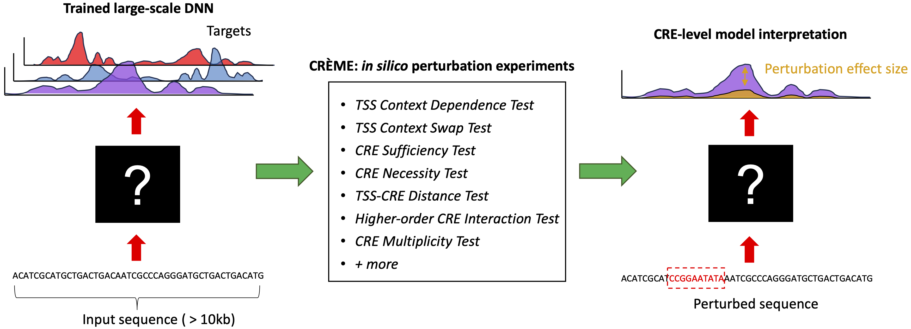

# CREME (get the money!)





[CREME](https://www.youtube.com/watch?v=PBwAxmrE194) (Cis-Regulatory Element Model Explanations) is an in silico perturbation framework designed to examine large-scale DNNs trained on regulatory genomics data. CREME can provide interpretations at various scales, including a coarse-grained CRE-level view as well as a fine-grained motif-level view. CREME can be used to identify cis-regulatory elements (CREs) that directly enhance or silence target genes. CREME can also be used to map CRE distance from transcription start sites and gene expression, as well as the intricate complexity of higher-order CRE interactions. 


CREME is based on the notion that by fitting experimental data, the DNN essentially approximates the underlying "function" of the experimental assay. Thus, the trained DNN can be treated as a surrogate for the experimental assay, enabling in silico "measurements" for any  sequence. CREME comprises a suite of perturbation experiments to uncover how DNNs learn rules of interactions between CREs and their target genes


 
CREME is pip installable:
```
pip install creme-nn
```

# CREME: Cis-Regulatory Element Model Explanations


CREME (Cis-Regulatory Element Model Explanations) is an advanced in silico perturbation framework designed to examine large-scale Deep Neural Networks (DNNs) trained on regulatory genomics data. CREME provides interpretations at various scales, from a coarse-grained CRE-level view to a fine-grained motif-level view.

## Key Features

- Identify cis-regulatory elements (CREs) that directly enhance or silence target genes
- Map CRE distance from transcription start sites and gene expression
- Analyze the intricate complexity of higher-order CRE interactions
- Treat trained DNNs as surrogates for experimental assays, enabling in silico "measurements" for any sequence

## Core Functions

1. `context_dependence_test`: Examines how sequence patterns behave in different background contexts.
2. `context_swap_test`: Analyzes the effect of placing a source sequence pattern in a target sequence context.
3. `necessity_test`: Measures the impact of tile shuffles on model predictions.
4. `sufficiency_test`: Determines if a region of the sequence, along with the TSS tile, is sufficient for model predictions.
5. `distance_test`: Maps the distance dependence between two tiles (one anchored, one variable).
6. `higher_order_interaction_test`: Performs a greedy search to identify optimal tile sets for changing model predictions.
7. `multiplicity_test`: Examines the effect of multiple copies of a CRE on model predictions.
8. `prune_sequence`: Optimizes a tile through greedy search to find the most enhancing subset of sub-tiles.

## Installation

CREME is pip installable:

```bash
pip install creme-nn


## Dependencies

numpy
tqdm
keras (for model compatibility)

## Usage
For detailed usage instructions and examples, please refer to our documentation and tutorials.
Colab Examples

Colab examples:
- Examples of CREME tests with Enformer: https://colab.research.google.com/drive/1j3vXKf4QNgCWoIp655ugxEGyBN0cp4K5?usp=sharing
- Example of CREME with a PyTorch version of Enformer: https://colab.research.google.com/drive/1c0ac3ei4Ntx0AgTaRkr80O8wZNb-j6wu?usp=sharing


#### Tutorials: https://creme-nn.readthedocs.io/en/latest/tutorials.html

#### Results to replicate paper with intermediate results: https://zenodo.org/records/12584210 

## Resources

#### Paper: https://www.biorxiv.org/content/10.1101/2023.07.03.547592v1

#### Full documentation on [Readthedocs.org](https://creme-nn.readthedocs.io/en/latest/index.html)!


## Citation
If you use CREME in your research, please cite our paper:
Toneyan S, Koo PK. Interpreting cis-regulatory interactions from large-scale deep neural networks for genomics. bioRxiv. 2023 Jul 3.

## License
[MIT License](https://github.com/p-koo/creme-nn/blob/master/LICENSE)

## Contact
email: koo@cshl.edu 
 
CREME is pip installable:
```
pip install creme-nn
```

