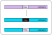
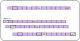
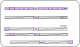
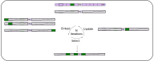

Usage
=====

Context dependence test
------------------------
.. image:: ../diagrams/context_dependence_test.svg
  :width: 400

.. autofunction:: creme.context_dependence_test

Context swap test
------------------

.. autofunction:: creme.context_swap_test

Necessity test
--------------

.. autofunction:: creme.necessity_test

Sufficiency test
----------------

.. autofunction:: creme.sufficiency_test

Distance Test
--------------

.. autofunction:: creme.distance_test

Higher order interaction test
------------------------------

.. autofunction:: creme.higher_order_interaction_test

Multiplicity test
------------------

.. autofunction:: creme.multiplicity_test

Fine-tile search
-----------------

.. autofunction:: creme.prune_sequence

Extra functions
----------------

.. autofunction:: creme.generate_tile_shuffles

